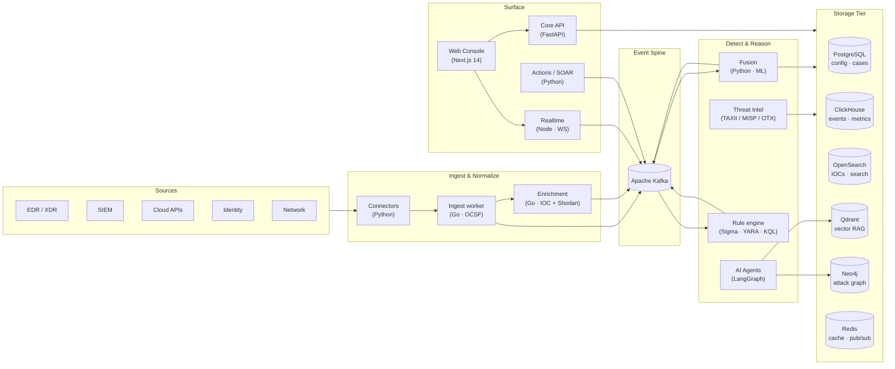

<div align="center">


# AiSOC

### Open-source AI Security Operations Center by [Cyble](https://cyble.com)

Real-time detection, autonomous triage, and MITRE ATT&CK-aware investigation in one MIT-licensed platform.

[](https://opensource.org/licenses/MIT)
[](https://cyble.com)
[](#)
[](CONTRIBUTING.md)

[**Live demo**](#-quick-start) · [**Architecture**](#-architecture) · [**Console tour**](#-console-tour) · [**Roadmap**](ROADMAP.md) · [**Contributing**](CONTRIBUTING.md)

</div>

---

## ✨ Why AiSOC

Modern SOCs drown in alerts and pivot across a dozen consoles. AiSOC is a **single, opinionated stack** that:

- **Ingests** events from any connector (CrowdStrike, Splunk, AWS, Okta, Sentinel) into a Kafka spine.
- **Correlates** them in real time with deduplication, ML scoring, and Sigma/YARA detection.
- **Enriches** every signal with threat-intel from TAXII 2.1, MISP, OTX, and CISA KEV.
- **Reasons** about attacks via a LangGraph multi-agent system grounded in MITRE ATT&CK.
- **Responds** with blast-radius-aware SOAR actions, every step explainable.

Everything ships under **MIT** — fork it, self-host it, audit it, extend it.

---

## 🚀 Highlights

<table>
<tr>
<td valign="top" width="50%">

### ⚡ Real-time fusion
- Kafka spine with sub-second ingestion
- Bloom-filter dedup on 10M+ IOCs
- LightGBM + Isolation Forest scoring
- Live WebSocket feed into the console

### 🧠 AI Copilot
- LangGraph agents with persistent memory
- Qdrant RAG over MITRE ATT&CK + tenant data
- Natural-language threat hunts
- Every decision traceable end-to-end

### 🕸️ Knowledge graph
- Neo4j entity graph (hosts, users, alerts, IOCs)
- Attack-path reconstruction per case
- Blast-radius gating on automated actions

</td>
<td valign="top" width="50%">

### 🎯 Detection engineering
- Sigma over OpenSearch + ClickHouse
- YARA file/memory scanning
- KQL, EQL, Lucene, regex query types
- On-demand hunts via REST

### 🌐 Threat intelligence
- TAXII 2.1, MISP, OTX, CISA KEV pollers
- Triple storage: search · vector · graph
- Auto-correlated `VULNERABILITY_MATCH` events
- Shodan + CVE enrichment in Go

### 🛡️ Built for production
- Multi-tenant with Postgres RLS
- JWT + API keys + RBAC
- Audit-grade event log
- Helm chart + Terraform modules

</td>
</tr>
</table>

---

## 🏗️ Architecture



### 🔌 Service map

| Service | Lang | Port | Role |
|---|---|---|---|
| `web` | Next.js 14 + React | 3000 | SOC console + marketing landing |
| `api` | Python · FastAPI | 8000 | Alerts, cases, RBAC, graph, rules |
| `realtime` | Node.js · `ws` | 8086 | Per-channel WebSocket fan-out |
| `agents` | Python · LangGraph | 8001 | Multi-agent reasoning + Qdrant RAG |
| `fusion` | Python | 8003 | Dedup + ML scoring (LightGBM, IsoForest) |
| `actions` | Python | 8002 | SOAR with blast-radius gating |
| `threatintel` | Python | 8005 | TAXII / MISP / OTX / KEV polling |
| `ingest` | Go | 8081 | OCSF normalization + Shodan/CVE |
| `enrichment` | Go | 8080 | IOC enrichment (VT, AbuseIPDB, GreyNoise) |

### 🗄️ Storage tier

| Store | Purpose |
|---|---|
| **PostgreSQL** | Tenants, users, cases, detection rules · Row-level security |
| **ClickHouse** | High-cardinality event analytics + alert metrics |
| **OpenSearch** | Full-text IOC + actor + report search · Sigma backend |
| **Qdrant** | Vector RAG for agents, semantic ATT&CK lookup |
| **Neo4j** | Knowledge graph: entities, attack paths, blast radius |
| **Redis** | Cache, pub/sub, IOC bloom filter, enrichment TTL |
| **Kafka** | Event streaming spine (raw, fused, vulnerability, action) |

---

## 🖥️ Console tour

The console fuses the analyst's day-zero workflow into one cohesive surface:

- **Dashboard** — live KPI tiles + trend chart + WebSocket-driven event ticker
- **Alerts & Cases** — triage queues, status workflow, evidence timeline
- **Attack Graph** — Cytoscape + fcose layout over the Neo4j subgraph for a case
- **MITRE Heatmap** — coverage tiles with per-tactic technique density
- **Threat Hunting** — Sigma / KQL / YARA editor with on-demand hunts
- **Detection Rules** — Monaco-powered rule builder with Sigma autocompletion
- **Threat Intel** — IOC search, feed status, and STIX/MISP source health
- **AI Copilot** — slide-over dock invoked with `⌘J` for any page
- **Command palette** — global `⌘K` for navigation, quick actions, and Copilot

> **Marketing landing** lives at `/` and the console at `/dashboard`. Both share the same brand tokens.

---

## 🚀 Quick start

### Prerequisites

- Docker 24+ and Docker Compose v2
- Node.js 20+ and pnpm 8+
- Go 1.21+ and Python 3.11+ (only for local service hacking)

### 1 · Clone

```bash
git clone https://github.com/beenuar/AiSOC.git
cd aisoc
cp .env.example .env  # if missing, see Configuration below
```

### 2 · Configure

```env
# AI providers (one is required)
ANTHROPIC_API_KEY=sk-ant-...
OPENAI_API_KEY=sk-...

# Optional enrichment
VIRUSTOTAL_API_KEY=...
ABUSEIPDB_API_KEY=...
GREYNOISE_API_KEY=...
SHODAN_API_KEY=...

# Optional TAXII feeds (URL,collection,user,pass tuples, comma-joined)
TAXII_FEEDS=https://cti-taxii.mitre.org/taxii/,enterprise-attack,,
```

### 3 · Boot

```bash
docker compose up -d
docker compose ps
```

First start takes ~60s while datastores warm up.

### 4 · Seed demo data

```bash
pnpm seed:demo            # generates cases, alerts, IOCs, attack paths
```

This produces realistic, scrubbed traffic so the console is alive on first load.

### 5 · Open

| Surface | URL | Notes |
|---|---|---|
| Marketing | http://localhost:3000 | Public landing page |
| Console | http://localhost:3000/dashboard | Default user: `admin@aisoc.local` / `changeme` |
| API | http://localhost:8000/docs | Swagger UI |
| Agents | http://localhost:8001/docs | LangGraph runner |
| Realtime WS | ws://localhost:8086/ws/alerts | Live alert channel |
| Neo4j | http://localhost:7474 | `neo4j` / `neo4j_dev_secret` |
| Grafana | http://localhost:3001 | `admin` / `admin` (`monitoring` profile) |
| Jaeger | http://localhost:16686 | Distributed traces (`monitoring` profile) |

### Optional profiles

```bash
docker compose --profile connectors up -d   # CrowdStrike, Splunk, AWS, Okta, Sentinel
docker compose --profile monitoring up -d   # Prometheus, Grafana, Jaeger
```

---

## 🧩 Monorepo layout

```
aisoc/
├── apps/
│   └── web/              # Next.js 14 console + marketing landing
├── services/
│   ├── api/              # Core REST API + Neo4j graph + rule engine
│   ├── ingest/           # Go · OCSF normalization · Shodan + CVE
│   ├── enrichment/       # Go · IOC enrichment
│   ├── fusion/           # Python · dedup + ML scoring
│   ├── agents/           # Python · LangGraph + Qdrant RAG
│   ├── actions/          # Python · SOAR + blast-radius gating
│   ├── threatintel/      # Python · TAXII / MISP / OTX / KEV
│   └── realtime/         # Node.js · per-channel WebSocket fan-out
├── integrations/         # Connector implementations
├── packages/
│   ├── types/            # Shared TS types
│   ├── ui/               # Shared React primitives
│   └── ocsf/             # OCSF normalization
├── infra/
│   ├── terraform/        # AWS (VPC, EKS, RDS)
│   └── helm/             # Kubernetes Helm chart
├── docs/                 # System design, API ref, runbooks
└── docker-compose.yml
```

---

## 👩‍💻 Development

### Frontend

```bash
cd apps/web
pnpm install
pnpm dev
```

The web app proxies the API and realtime services. Run them separately or boot the docker compose stack.

### Backend (selective)

```bash
docker compose up -d postgres redis kafka clickhouse opensearch qdrant neo4j

cd services/api && poetry install && poetry run uvicorn app.main:app --reload --port 8000
cd services/fusion && poetry install && poetry run uvicorn app.main:app --reload --port 8003
cd services/ingest && go run main.go
cd services/threatintel && poetry install && poetry run uvicorn app.main:app --reload --port 8005
```

### Tests

```bash
cd apps/web && pnpm test
cd services/api && poetry run pytest
cd services/ingest && go test ./...
```

---

## ☸️ Deployment

### Kubernetes (recommended)

```bash
helm repo add bitnami https://charts.bitnami.com/bitnami
helm install aisoc ./infra/helm/aisoc \
  --namespace aisoc \
  --create-namespace \
  --values ./infra/helm/aisoc/values.yaml \
  --set global.environment=production
```

### Terraform on AWS

```bash
cd infra/terraform
terraform init
terraform plan -var="environment=prod"
terraform apply
```

---

## 🔭 Roadmap

We publish the public roadmap in [ROADMAP.md](ROADMAP.md). Highlights for the next quarter:

- v0.4 — multi-region replication, OPA-based action policies
- v0.5 — agent-authored detections with human-in-the-loop review
- v0.6 — federated threat intel sharing across self-hosted instances

---

## 🤝 Contributing

We welcome PRs of every size. Read [CONTRIBUTING.md](CONTRIBUTING.md) for the workflow and the [Code of Conduct](CODE_OF_CONDUCT.md) before opening a PR.

Good first issues:

- Adding new connector integrations
- Expanding MITRE ATT&CK coverage
- Frontend UI polish
- Documentation and tutorials
- Test coverage

---

## 🔐 Security

Found a security issue? Please **do not** open a public issue. Email `security@cyble.com` (PGP key in [SECURITY.md](SECURITY.md)). We follow coordinated disclosure.

---

## 📜 License

[MIT](LICENSE) — © 2024–present [Cyble Inc.](https://cyble.com)

---

<div align="center">

**Built with ❤️ by [Cyble](https://cyble.com) and the open-source community.**

[Report a bug](https://github.com/beenuar/AiSOC/issues/new?template=bug_report.md) · [Request a feature](https://github.com/beenuar/AiSOC/issues/new?template=feature_request.md) · [Become a contributor](CONTRIBUTING.md)

</div>
